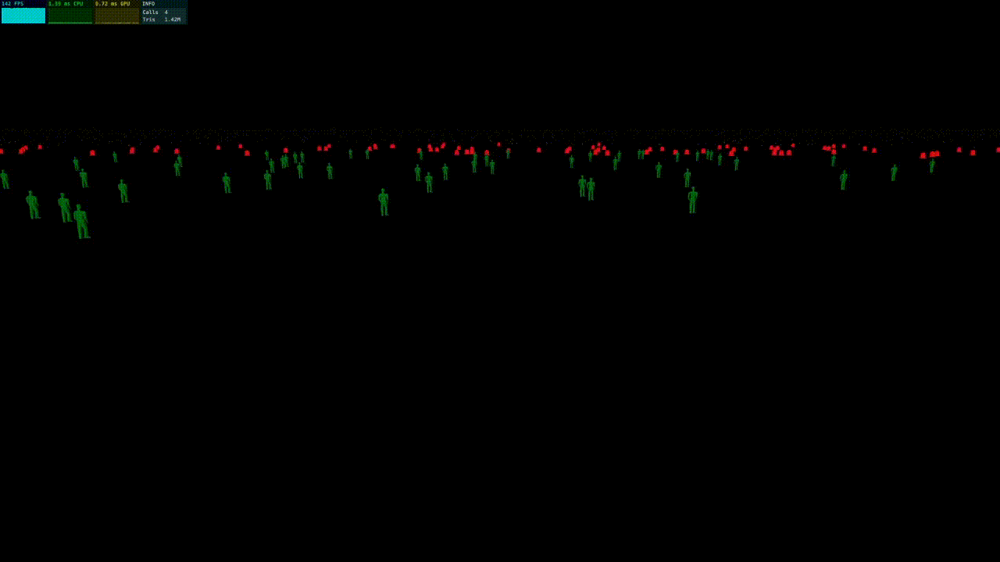

# millions-die-or-saved-idk

<div id="top"></div
<div align="center">



  <h3 align="center">A scene where LOD (level of detail) adjusts based on camera distance, but instead of its usual purpose (like nanite does natively for Unreal engine), it shows people living, dying, and souls. Thats the idea. </h3>

</div>

using:

- three
- three.ez/main
- three.ez/instanced-mesh

## Installation
```
npm install

npm run dev
```

## Resources + models

- [instanced-mesh docs](https://agargaro.github.io/instanced-mesh/)
- [hourglass](http://poly.pizza/m/4U7CyyvH6zz) 
- [human](https://poly.pizza/m/3wn-0Holuje) 
- [grave](https://poly.pizza/m/AbFrVeMhim) 